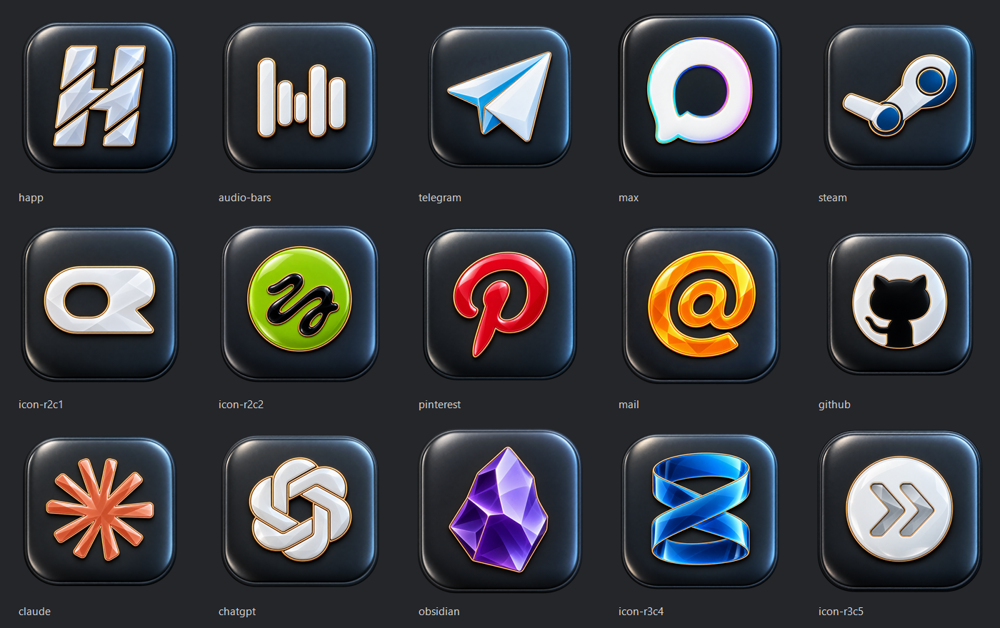

# Obsidian Brand Icons

15 stylized app icons, each **256 × 256 px**, PNG RGBA with transparent outer corners.

Glossy faceted logos on dark graphite rounded tiles. Brand accent colors are retained; monochrome marks remain white or black. No peripheral beads or wires. MAX uses an upright contour based on the supplied reference.

## Download

Download the ZIP from [Releases](https://github.com/GamoffVad/obsidian-brand-icons/releases/latest), or use individual files in `icons/`.

## Contents

Happ, waveform bars, Telegram, MAX, Steam, Pinterest, Mail, GitHub, Claude, ChatGPT, Obsidian and four reference-based symbols.

The filenames `icon-r2c1`, `icon-r2c2`, `icon-r3c4`, and `icon-r3c5` refer to row and column positions in the original supplied grid; their service names are unconfirmed. `audio-bars` is likewise named descriptively.

## Creation

Created with the built-in imagegen tool, then resized to 256 × 256. Generation prompts are in `prompts.json`. Images are stylized interpretations of the supplied logos.
